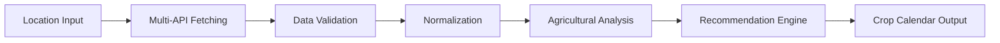

# 🌾 Crop Calendar - Agricultural Advisory System

> **A comprehensive full-stack application that generates personalized crop calendars for farmers using real-time satellite data and agricultural intelligence.**

[](https://opensource.org/licenses/MIT)
[](https://nodejs.org/)
[](https://reactjs.org/)
[](https://www.typescriptlang.org/)

## � Overview

The Crop Calendar application revolutionizes agricultural planning by providing farmers with:

### 🚀 **Core Features**
- **🛰️ Real-time Satellite Data Integration** - Copernicus, NASA, and OpenWeather APIs
- **📅 Personalized Crop Calendars** - AI-powered planting, fertilization, and harvesting schedules  
- **🌍 Location-Based Intelligence** - GPS-enabled precise agricultural recommendations
- **📱 Responsive Design** - Seamless experience across desktop, tablet, and mobile
- **🤖 AI Recommendations** - Machine learning-enhanced agricultural insights
- **📊 Data-Driven Insights** - Vegetation indices, soil moisture, and weather analytics

### 🎯 **Target Users**
- **Small-scale farmers** seeking optimized crop planning
- **Agricultural consultants** providing data-driven advice
- **Agricultural cooperatives** supporting member farmers
- **Agricultural researchers** studying crop patterns

## 🏗️ System Architecture

### **Technology Stack Overview**

```
┌─────────────────────┐    ┌─────────────────────┐    ┌─────────────────────┐
│   Frontend (React)  │    │  Backend (Node.js)  │    │  External APIs      │
│   • TypeScript      │◄──►│  • Express.js       │◄──►│  • Copernicus       │
│   • Material-UI     │    │  • Satellite Svcs   │    │  • NASA Earth       │
│   • Context API     │    │  • Crop Database    │    │  • OpenWeather      │
└─────────────────────┘    └─────────────────────┘    └─────────────────────┘
```

### **Backend Architecture (Node.js/Express)**
- **🚀 RESTful API Server** - Express.js framework with comprehensive routing
- **🛰️ Satellite Data Services** - Multi-source data aggregation (Copernicus, NASA, OpenWeather)
- **🌾 Crop Calendar Engine** - Advanced algorithms for agricultural timeline generation
- **📊 Agricultural Database** - JSON-based comprehensive crop information system
- **✅ Input Validation** - Express-validator for robust data validation
- **🔐 Security Middleware** - CORS, Helmet, and error handling

### **Frontend Architecture (React/TypeScript)**
- **⚛️ Modern React 19** - Latest React features with TypeScript integration
- **🎨 Material-UI Design System** - Professional components with agricultural theme
- **🔄 Context API State Management** - Centralized state for crop calendar workflow
- **📱 Responsive Design** - Mobile-first approach with adaptive layouts
- **🌐 React Router Navigation** - Seamless single-page application experience
- **📡 Axios HTTP Client** - Robust API communication with error handling

## 🚀 Quick Start Guide

### **Prerequisites**
- **Node.js**: Version 16 or higher ([Download](https://nodejs.org/))
- **npm**: Comes with Node.js (or use yarn)
- **Git**: For cloning the repository
- **Modern Browser**: Chrome, Firefox, Safari, or Edge

### **Installation & Setup**

#### **1. Clone and Install Dependencies**
```bash
# Clone the repository
git clone https://github.com/Sonali177/CropCalendar.git
cd CropCalendar

# Install all dependencies (root, backend, and frontend)
npm run install:all
```

#### **2. Environment Configuration (Optional)**
```bash
cd backend
cp .env.example .env
```

**Environment Variables (.env):**
```bash
# Server Configuration
PORT=5001
NODE_ENV=development
CORS_ORIGIN=http://localhost:3000

# API Keys (Optional - works with demo data)
NASA_API_KEY=your_nasa_api_key_here
OPENWEATHER_API_KEY=your_openweather_api_key_here
COPERNICUS_USERNAME=your_copernicus_username
COPERNICUS_PASSWORD=your_copernicus_password

# AI Service (Optional)
HUGGINGFACE_API_KEY=your_huggingface_api_key
```

#### **3. Start Development Servers**
```bash
# Start both backend and frontend concurrently
npm run dev
```

**Alternative - Start Individually:**
```bash
# Backend only (port 5001)
npm run server:dev

# Frontend only (port 3000)  
npm run client:dev
```

#### **4. Access the Application**
- 🌐 **Frontend**: http://localhost:3000
- 🔗 **Backend API**: http://localhost:5001  
- ✅ **Health Check**: http://localhost:5001/health

### **🎬 First Run Experience**
1. **Location Selection** - Use GPS or manually enter coordinates
2. **Crop Selection** - Choose from supported crops (wheat, rice, maize, tomato, potato)
3. **Farm Area Input** - Specify area in various units (hectares, acres, sq ft, etc.)
4. **Generate Calendar** - Get your personalized crop calendar with satellite insights!

## 📡 API Documentation

### **Core API Endpoints**

#### **🌾 Crop Calendar API**

**Generate Crop Calendar**
```http
POST /api/crop-calendar/generate
Content-Type: application/json

{
  "location": {
    "latitude": 18.5659,
    "longitude": 73.9502
  },
  "area": 2.5,
  "cropType": "rice"
}
```

**Get Supported Crops**
```http
GET /api/crop-calendar/crops
```

**Validate Location**
```http
POST /api/crop-calendar/validate-location
Content-Type: application/json

{
  "location": {
    "latitude": 18.5659,
    "longitude": 73.9502
  }
}
```

#### **🛰️ Satellite Data API**

**Current Satellite Data**
```http
POST /api/satellite-data/current
Content-Type: application/json

{
  "location": {
    "latitude": 18.5659,
    "longitude": 73.9502
  }
}
```

### **Response Format**

**Success Response:**
```json
{
  "success": true,
  "data": {
    "cropCalendar": { /* Calendar data */ },
    "satelliteData": {
      "vegetationIndex": { "ndvi": 0.85, "evi": 0.72 },
      "soilMoisture": { "percentage": 45, "status": "optimal" },
      "temperature": { "current": 28, "min": 22, "max": 35 },
      "precipitation": { "last7Days": 15, "last30Days": 85 }
    },
    "metadata": {
      "generatedAt": "2025-07-23T10:00:00Z",
      "location": { /* Location data */ },
      "area": 2.5,
      "cropType": "rice"
    }
  }
}
```

**Error Response:**
```json
{
  "success": false,
  "error": "Validation failed",
  "details": [
    {
      "type": "field",
      "value": 0.0001,
      "msg": "Area must be a positive number greater than 0.001 hectares",
      "path": "area",
      "location": "body"
    }
  ]
}
```

### **Input Validation Rules**

| Field | Type | Validation | Description |
|-------|------|------------|-------------|
| `location.latitude` | `number` | `-90 ≤ value ≤ 90` | Valid latitude coordinate |
| `location.longitude` | `number` | `-180 ≤ value ≤ 180` | Valid longitude coordinate |
| `area` | `number` | `≥ 0.001` | Farm area in hectares (minimum ~10 sq meters) |
| `cropType` | `string` | `2-50 chars` | Supported crop identifier |

## 🌱 Supported Crops & Database

### **Current Crop Catalog**

| Crop | Scientific Name | Category | Growing Period | Status |
|------|----------------|----------|----------------|---------|
| **🌾 Wheat** | *Triticum aestivum* | Cereal | 120-150 days | ✅ Fully Supported |
| **🌾 Rice** | *Oryza sativa* | Cereal | 100-130 days | ✅ Fully Supported |
| **🌽 Maize** | *Zea mays* | Cereal | 90-120 days | ✅ Fully Supported |
| **🍅 Tomato** | *Solanum lycopersicum* | Vegetable | 70-100 days | ✅ Fully Supported |
| **🥔 Potato** | *Solanum tuberosum* | Vegetable | 80-120 days | ✅ Fully Supported |

### **Comprehensive Crop Data Includes:**

#### **📊 Growth Analytics**
- **Growth Stages**: Germination, vegetative, flowering, maturity phases
- **Timeline Management**: Stage-specific durations and transitions
- **Critical Activities**: Key farming tasks for each growth phase
- **Care Instructions**: Detailed agricultural guidance

#### **💧 Resource Management**
- **Fertilization Schedules**: NPK requirements by growth stage
- **Irrigation Plans**: Water requirements and timing
- **Cost Estimation**: Fertilizer and water cost calculations
- **Resource Optimization**: Efficiency recommendations

#### **🌍 Environmental Factors**
- **Seasonal Considerations**: Optimal planting windows by hemisphere
- **Climate Requirements**: Temperature and precipitation needs
- **Soil Conditions**: pH, drainage, and nutrient requirements
- **Risk Assessment**: Weather and pest risk factors

#### **📈 Yield Predictions**
- **Expected Yields**: Area-based production estimates
- **Quality Metrics**: Harvest quality indicators
- **Market Readiness**: Optimal harvest timing
- **Storage Guidelines**: Post-harvest handling recommendations

## 🛰️ Satellite Data Integration & Sources

### **🌍 Production Data Sources**

#### **1. Copernicus Climate Data Store** ⭐ *Primary Source*
- **Purpose**: European satellite constellation data
- **Data**: High-resolution vegetation indices, soil moisture, land cover
- **Coverage**: Global, updated daily
- **Authentication**: Username/password required
- **Advantages**: Most accurate and comprehensive data

#### **2. NASA Earth API** 🚀
- **Purpose**: Landsat and MODIS satellite imagery
- **Data**: NDVI, EVI vegetation indices, surface temperature
- **Coverage**: Global, 16-day revisit cycle
- **Authentication**: API key required
- **Rate Limits**: 1,000 requests/hour (Demo: 30/hour)

#### **3. OpenWeatherMap API** 🌤️
- **Purpose**: Real-time weather and climate data
- **Data**: Temperature, precipitation, humidity, wind, forecasts
- **Coverage**: Global, real-time updates
- **Authentication**: API key required
- **Rate Limits**: 60 calls/minute (Free tier)

#### **4. Intelligent Simulation System** 🧠
- **Purpose**: Demo mode and fallback data generation
- **Algorithm**: Location-aware realistic data synthesis
- **Accuracy**: Calibrated against real satellite data
- **Usage**: Development, testing, and demo environments

### **📊 Data Points Collected**

#### **🌿 Vegetation Health Monitoring**
- **NDVI** (Normalized Difference Vegetation Index): -1 to +1 scale
- **EVI** (Enhanced Vegetation Index): Improved vegetation assessment  
- **Vegetation Coverage**: Percentage of green vegetation
- **Crop Health Status**: Excellent, Good, Fair, Poor classifications

#### **💧 Soil & Water Analytics**
- **Soil Moisture**: Percentage and depth measurements
- **Moisture Status**: Dry, Optimal, Wet classifications
- **Drainage Assessment**: Surface water conditions
- **Irrigation Needs**: Automated watering recommendations

#### **🌡️ Climate & Weather Conditions**
- **Temperature**: Current, min/max, historical averages
- **Precipitation**: Last 7 days, 30 days, seasonal totals
- **Humidity**: Relative humidity percentages
- **Wind Speed**: Current conditions and patterns
- **Cloud Cover**: Sunlight availability assessment
- **Sunlight Hours**: Daily solar radiation exposure

### **🔄 Data Processing Pipeline**



### **⚡ Real-time Updates**
- **Refresh Frequency**: Every 4 hours for critical data
- **Cache Strategy**: Intelligent caching to optimize API usage
- **Fallback System**: Automatic failover to simulation data
- **Data Confidence**: Quality scores for all satellite measurements

## ✨ Features & Functionality

### **🌾 For Farmers**

#### **📍 Smart Location Services**
- **GPS Integration**: One-click current location detection
- **Manual Coordinate Input**: Precise latitude/longitude entry
- **Location Validation**: Agricultural suitability assessment
- **Multiple Location Support**: Save and manage multiple farm locations

#### **🌱 Intelligent Crop Selection**
- **Crop Database**: 5+ fully supported crops with detailed information
- **Search & Filter**: Easy crop discovery by category or name
- **Crop Information Cards**: Scientific names, growing periods, requirements
- **Seasonal Recommendations**: Location-based optimal crop suggestions

#### **📏 Flexible Area Management**
- **Multiple Units**: Hectares, acres, square meters, square feet, square kilometers
- **Unit Conversion**: Automatic conversion with precision handling
- **Area Validation**: Smart validation for different farm sizes
- **Quick Selection**: Pre-defined common farm sizes

#### **📅 Comprehensive Crop Calendars**
- **Personalized Timelines**: Custom schedules based on location and satellite data
- **Growth Stage Tracking**: Detailed phase-by-phase guidance
- **Activity Scheduling**: Fertilization, irrigation, and maintenance tasks
- **Date Calculations**: Precise timing with local climate considerations

#### **🛰️ Real-time Agricultural Intelligence**
- **Vegetation Health**: NDVI/EVI satellite monitoring
- **Soil Moisture**: Current moisture levels and irrigation needs
- **Weather Integration**: 7-day forecasts and historical data
- **Risk Assessment**: Climate and environmental risk factors

#### **📱 Mobile-First Experience**
- **Responsive Design**: Perfect experience on phones, tablets, desktops
- **Touch-Friendly**: Optimized for mobile interactions
- **Offline Capability**: Core features work without internet
- **Fast Loading**: Optimized performance for rural connectivity

### **👨‍💻 For Developers**

#### **🏗️ Modern Architecture**
- **TypeScript**: Full type safety across frontend and API contracts
- **Component-Based**: Reusable React components with clear separation
- **Context API**: Centralized state management without Redux complexity
- **Material-UI**: Professional design system with customizable themes

#### **🔌 API Integration**
- **RESTful Design**: Well-structured endpoints with consistent responses
- **Error Handling**: Comprehensive error responses with detailed messages
- **Loading States**: Proper UX feedback for all async operations
- **Retry Logic**: Automatic retry for failed satellite data requests

#### **🧪 Development Experience**
- **Hot Reload**: Both frontend and backend with automatic restarts
- **Debugging**: Console logging and error tracking throughout
- **Environment Management**: Easy switching between development and production
- **Code Quality**: ESLint, TypeScript, and consistent formatting

### **🚀 Recent Enhancements (v1.0.0)**

#### **✅ Bug Fixes & Improvements**
- **Area Validation Fix**: Reduced minimum area from 0.1 to 0.001 hectares
- **Unit Conversion**: Improved precision for small farm plots
- **Error Messages**: Enhanced user-friendly validation feedback
- **API Reliability**: Better error handling and fallback mechanisms
- **Mobile UX**: Improved touch interactions and responsive layouts

#### **🆕 New Features**
- **Copernicus Integration**: Added European satellite data as primary source
- **AI Recommendations**: Integrated Hugging Face ML models for enhanced insights
- **Debug Logging**: Comprehensive logging for troubleshooting
- **Production Mode**: Robust production deployment configuration
- **GitHub Integration**: Complete repository setup with documentation

## 🔧 Development

## 🔧 Development & Debugging

### **Project Structure**
```
CropCalendar/
├── 📁 backend/                    # Node.js API server
│   ├── 📁 data/                  # JSON crop database
│   │   └── cropData.js           # Comprehensive crop information
│   ├── 📁 routes/                # Express route handlers
│   │   ├── cropCalendar.js       # Crop calendar endpoints
│   │   ├── satelliteData.js      # Satellite data endpoints
│   │   └── aiRecommendations.js  # AI-powered recommendations
│   ├── 📁 services/              # Business logic layer
│   │   ├── cropCalendarService.js # Calendar generation engine
│   │   ├── satelliteDataService.js # Multi-API data aggregation
│   │   └── aiRecommendationService.js # ML recommendations
│   ├── server.js                 # Express server entry point
│   ├── .env.example             # Environment variables template
│   └── package.json             # Backend dependencies
├── 📁 frontend/                   # React TypeScript application
│   ├── 📁 src/
│   │   ├── 📁 components/        # Reusable UI components
│   │   │   ├── LocationStep.tsx  # GPS/manual location input
│   │   │   ├── CropSelectionStep.tsx # Crop selection interface
│   │   │   ├── AreaStep.tsx      # Farm area input with unit conversion
│   │   │   └── CalendarResults.tsx # Generated calendar display
│   │   ├── 📁 pages/             # Page-level components
│   │   │   ├── HomePage.tsx      # Landing page
│   │   │   └── CropCalendarPage.tsx # Main application flow
│   │   ├── 📁 context/           # React Context providers
│   │   │   └── CropCalendarContext.tsx # Global state management
│   │   ├── 📁 services/          # API client layer
│   │   │   └── api.ts           # Axios-based API communication
│   │   ├── 📁 types/             # TypeScript type definitions
│   │   │   └── index.ts         # Shared interfaces and types
│   │   └── 📁 theme/             # Material-UI theming
│   │       └── theme.ts         # Agricultural color palette
│   └── package.json             # Frontend dependencies
├── 📁 .github/                   # GitHub configuration
│   └── copilot-instructions.md  # AI assistant instructions
├── package.json                 # Root package.json with scripts
├── .gitignore                   # Git ignore patterns
├── README.md                    # This documentation
├── DOCUMENTATION.md             # Detailed technical documentation
└── COPERNICUS_SETUP.md         # Satellite API setup guide
```

### **Available npm Scripts**

#### **🚀 Development Commands**
```bash
npm run dev                 # Start both frontend and backend concurrently
npm run server:dev          # Backend only with nodemon hot reload
npm run client:dev          # Frontend only with React dev server
npm run install:all         # Install dependencies for all packages
```

#### **🏗️ Production Commands**
```bash
npm run build              # Build optimized frontend bundle
npm run start              # Start production backend server
npm run client:build       # Frontend production build only
```

#### **🔍 Utility Commands**
```bash
npm run server:start       # Start backend without hot reload
cd backend && npm test     # Run backend tests
cd frontend && npm test    # Run frontend tests
```

### **🐛 Common Issues & Solutions**

#### **Issue: "Validation failed" Error**
**Problem**: Area validation failing with small values
```
❌ Error: Area must be a positive number greater than 0.001 hectares
```
**Solution**: ✅ **Fixed in latest version** - Minimum area reduced from 0.1 to 0.001 hectares
- Small plots (100+ sq ft) now supported
- Better unit conversion handling
- Enhanced validation messages

#### **Issue: Port Already in Use**
**Problem**: `EADDRINUSE: address already in use :::3000`
**Solution**:
```bash
# Find and kill process using port 3000
lsof -ti:3000 | xargs kill -9
# Or use different ports
PORT=3001 npm run client:dev
```

#### **Issue: API Keys Not Working**
**Problem**: Satellite data showing as "simulated"
**Solution**:
1. Check `.env` file exists in `/backend/` directory
2. Verify API keys are properly set (no quotes needed)
3. Restart backend server after changing environment variables
4. Check API key validity and rate limits

#### **Issue: CORS Errors**
**Problem**: Frontend can't connect to backend
**Solution**: Ensure backend is running on correct port (5001) and CORS is configured:
```javascript
// Backend automatically handles CORS for localhost:3000
CORS_ORIGIN=http://localhost:3000
```

### **🔧 Environment Configuration**

#### **Backend Environment Variables**
```bash
# Required for production satellite data
NODE_ENV=production
COPERNICUS_USERNAME=your_copernicus_username
COPERNICUS_PASSWORD=your_copernicus_password
OPENWEATHER_API_KEY=your_openweather_key
NASA_API_KEY=your_nasa_key

# Optional AI enhancements
HUGGINGFACE_API_KEY=your_huggingface_key

# Server configuration
PORT=5001
CORS_ORIGIN=http://localhost:3000
```

#### **Development vs Production Modes**
- **Development**: Uses simulated data with realistic algorithms
- **Production**: Requires API keys for real satellite data
- **Hybrid**: Falls back to simulation when APIs are unavailable

## 🌟 Key Features Implemented

### Backend Features
✅ **Satellite Data Integration** - Real-time and simulated data  
✅ **Crop Calendar Generation** - Advanced agricultural algorithms  
✅ **Location Validation** - Agricultural suitability assessment  
✅ **Comprehensive Crop Database** - 5+ crops with detailed information  
✅ **RESTful API** - Well-documented endpoints with validation  
✅ **Error Handling** - Comprehensive error responses  

### Frontend Features  
✅ **Multi-step Form** - Guided crop calendar generation  
✅ **Location Services** - GPS integration and manual input  
✅ **Responsive Design** - Mobile-first approach  
✅ **Real-time Feedback** - Loading states and error handling  
✅ **Professional UI** - Material-UI with agricultural theme  
✅ **TypeScript Integration** - Full type safety  

## 🚧 Future Roadmap & Enhancements

### **📅 Phase 1: Core Enhancements (Q3 2025)**

#### **🌍 Enhanced Location Features**
- [ ] **Interactive Maps**: Leaflet.js integration for visual farm boundary selection
- [ ] **Multi-Farm Management**: Support for multiple farm locations per user
- [ ] **Satellite Imagery Overlay**: Visual crop health monitoring on maps
- [ ] **Weather Station Integration**: Local weather station data incorporation

#### **📊 Advanced Analytics Dashboard**
- [ ] **Historical Data Charts**: Multi-year crop performance visualization
- [ ] **Trend Analysis**: Seasonal and annual agricultural patterns
- [ ] **Yield Prediction Models**: ML-based harvest quantity forecasting
- [ ] **Cost-Benefit Analysis**: Economic planning and profitability tracking

#### **🌱 Expanded Crop Database**
- [ ] **10+ Additional Crops**: Legumes, fruits, cash crops expansion
- [ ] **Regional Varieties**: Location-specific crop strain recommendations
- [ ] **Intercropping Support**: Multi-crop calendar generation
- [ ] **Organic Farming**: Specialized organic agricultural practices

### **📅 Phase 2: User Experience & Automation (Q4 2025)**

#### **👤 User Management System**
- [ ] **User Authentication**: Secure login and profile management
- [ ] **Saved Calendars**: Persistent storage of generated crop calendars  
- [ ] **Farming History**: Track past seasons and outcomes
- [ ] **Collaboration Tools**: Share calendars with agricultural consultants

#### **🔔 Smart Notifications**
- [ ] **SMS Reminders**: Text message alerts for farming activities
- [ ] **Email Notifications**: Weekly progress reports and recommendations
- [ ] **Push Notifications**: Mobile app notifications for critical tasks
- [ ] **Weather Alerts**: Severe weather warnings and protective measures

#### **📱 Mobile Application**
- [ ] **Native Mobile Apps**: iOS and Android applications
- [ ] **Offline Functionality**: Core features without internet connectivity
- [ ] **Camera Integration**: Plant health assessment through photos
- [ ] **GPS Tracking**: Automatic farm boundary detection

### **📅 Phase 3: Advanced Intelligence (Q1 2026)**

#### **🤖 AI & Machine Learning**
- [ ] **Computer Vision**: Satellite image analysis for crop health assessment
- [ ] **Predictive Analytics**: Disease and pest outbreak predictions
- [ ] **Yield Optimization**: AI-driven fertilization and irrigation recommendations
- [ ] **Climate Adaptation**: Long-term climate change impact modeling

#### **🌐 IoT Integration**
- [ ] **Soil Sensors**: Real-time soil moisture and nutrient monitoring
- [ ] **Weather Stations**: Private weather station data integration
- [ ] **Drone Support**: Aerial crop monitoring and analysis
- [ ] **Smart Irrigation**: Automated irrigation system control

#### **🌍 Global Expansion**
- [ ] **Multi-Language Support**: Localization for global farming communities
- [ ] **Regional Databases**: Location-specific crop varieties and practices
- [ ] **Currency Support**: Local currency integration for cost calculations
- [ ] **Regulatory Compliance**: Region-specific agricultural regulations

### **📅 Phase 4: Ecosystem & Community (Q2 2026)**

#### **🤝 Community Features**
- [ ] **Farmer Forums**: Community discussion and knowledge sharing
- [ ] **Expert Network**: Access to agricultural consultants and experts
- [ ] **Best Practices Library**: Crowdsourced farming success stories
- [ ] **Local Market Integration**: Price tracking and selling opportunities

#### **📈 Enterprise Features**
- [ ] **Cooperative Management**: Multi-farmer agricultural cooperative tools
- [ ] **Supply Chain Integration**: Connection with suppliers and buyers
- [ ] **Insurance Integration**: Crop insurance and risk management
- [ ] **Government Reporting**: Compliance and subsidy application support

### **🎯 Technical Roadmap**

#### **⚡ Performance & Scalability**
- [ ] **Database Migration**: Move from JSON to PostgreSQL/MongoDB
- [ ] **Caching Layer**: Redis implementation for faster data access
- [ ] **CDN Integration**: Global content delivery for satellite imagery
- [ ] **Microservices**: Break monolithic backend into microservices

#### **🔒 Security & Compliance**
- [ ] **Data Encryption**: End-to-end encryption for sensitive farm data
- [ ] **GDPR Compliance**: European data protection compliance
- [ ] **Security Audits**: Regular penetration testing and vulnerability assessment
- [ ] **Backup Systems**: Automated backup and disaster recovery

### **💡 Innovation Labs**

#### **🔬 Research & Development**
- [ ] **Blockchain Integration**: Transparent supply chain tracking
- [ ] **Quantum Computing**: Advanced weather prediction models
- [ ] **AR/VR Features**: Virtual farm planning and visualization
- [ ] **5G Connectivity**: Ultra-fast data transmission for real-time monitoring

## 🤝 Contributing to Crop Calendar

We welcome contributions from developers, agricultural experts, and farming communities! Here's how you can help improve this agricultural advisory platform:

### **🚀 Getting Started**

1. **Fork the Repository**
   ```bash
   # Fork on GitHub, then clone your fork
   git clone https://github.com/YOUR-USERNAME/CropCalendar.git
   cd CropCalendar
   npm run install:all
   ```

2. **Create a Feature Branch**
   ```bash
   git checkout -b feature/amazing-agricultural-feature
   ```

3. **Set Up Local Development**
   ```bash
   # Copy environment template
   cd backend && cp .env.example .env
   
   # Start development servers
   npm run dev
   ```

### **🌱 Areas for Contribution**

#### **🛰️ Data & APIs**
- **Additional Satellite Data Sources**: Integrate more satellite APIs
- **Weather Station Networks**: Add local meteorological data sources
- **Soil Database Enhancement**: Expand soil type and nutrient information
- **API Rate Limiting**: Implement intelligent API usage optimization

#### **🌾 Agricultural Knowledge**
- **Crop Database Expansion**: Add more crops with detailed growing information
- **Regional Farming Practices**: Location-specific agricultural techniques
- **Organic Farming Methods**: Sustainable and organic crop management
- **Pest & Disease Management**: Integrated pest management recommendations

#### **💻 Technical Improvements**
- **Performance Optimization**: Frontend and backend performance enhancements
- **Mobile App Development**: React Native mobile application
- **Testing Coverage**: Unit, integration, and E2E test improvements
- **Accessibility**: WCAG compliance and screen reader support

#### **🎨 User Experience**
- **UI/UX Design**: Enhanced visual design and user interactions
- **Internationalization**: Multi-language support for global users
- **Data Visualization**: Advanced charts and agricultural analytics
- **Responsive Design**: Cross-device compatibility improvements

### **📝 Contribution Guidelines**

#### **Code Standards**
- **TypeScript**: Use TypeScript for type safety (frontend and backend types)
- **ESLint**: Follow established linting rules and formatting
- **Component Architecture**: Create reusable, well-documented components
- **API Design**: Maintain RESTful conventions and consistent responses

#### **Documentation Requirements**
- **Code Comments**: Document complex agricultural algorithms and calculations
- **API Documentation**: Update endpoint documentation for new features
- **README Updates**: Keep installation and usage instructions current
- **Type Definitions**: Maintain comprehensive TypeScript interfaces

#### **Testing Expectations**
- **Unit Tests**: Test individual functions and components
- **Integration Tests**: Test API endpoints and data flow
- **Agricultural Validation**: Verify crop calendar accuracy with farming experts
- **Cross-Browser Testing**: Ensure compatibility across major browsers

### **🐛 Bug Reports & Feature Requests**

#### **Bug Report Template**
```
### Bug Description
Brief description of the issue

### Steps to Reproduce
1. Step one
2. Step two
3. Step three

### Expected Behavior
What should happen

### Actual Behavior  
What actually happens

### Environment
- Browser: Chrome/Firefox/Safari
- Device: Desktop/Mobile/Tablet
- Location: Country/Region
- Crop Type: If relevant

### Screenshots
If applicable, add screenshots
```

#### **Feature Request Template**
```
### Feature Description
Clear description of the proposed feature

### Agricultural Use Case
How would this help farmers?

### Technical Approach
Suggested implementation approach

### Priority Level
Low/Medium/High based on farming impact
```

### **🏆 Recognition**

Contributors will be recognized in:
- **README Contributors Section**: GitHub profile links
- **Release Notes**: Feature attribution in version releases
- **Agricultural Impact**: Highlight farming community benefits
- **Technical Blog Posts**: Featured development stories

### **📞 Community & Support**

- **GitHub Discussions**: Technical questions and feature discussions
- **Issues Tracker**: Bug reports and enhancement requests
- **Code Reviews**: Collaborative improvement process
- **Agricultural Experts**: Connections with farming professionals

*Together, we're building technology that helps feed the world! 🌾*

## 📄 License & Legal

This project is licensed under the **MIT License** - see the [LICENSE](LICENSE) file for complete details.

### **MIT License Summary**
- ✅ **Commercial Use**: Use in commercial agricultural applications
- ✅ **Modification**: Adapt for specific farming needs and regions
- ✅ **Distribution**: Share with farming communities and organizations
- ✅ **Private Use**: Use on private farms and agricultural operations
- ⚠️ **Attribution**: Must include original copyright and license notice
- ❌ **No Warranty**: Software provided "as-is" without guarantees

### **Third-Party Licenses**
- **Satellite Data**: Subject to respective API provider terms (NASA, Copernicus, OpenWeather)
- **Dependencies**: All npm packages maintain their individual licenses
- **Agricultural Data**: Crop information compiled from public agricultural sources

---

## 🆘 Support & Troubleshooting

### **🔧 Common Issues & Solutions**

#### **Application Won't Start**
```bash
# Check Node.js version (requires 16+)
node --version

# Clear npm cache and reinstall
npm cache clean --force
rm -rf node_modules package-lock.json
npm install

# Start with verbose logging
DEBUG=* npm run dev
```

#### **Satellite Data Issues**
- **"Simulated Data" Message**: API keys not configured (optional for demo)
- **Rate Limit Errors**: Wait for API rate limit reset or use demo mode
- **Location Errors**: Verify coordinates are within valid ranges (-90 to 90 latitude, -180 to 180 longitude)

#### **Validation Errors**
- **Area Too Small**: Minimum 0.001 hectares (~10 square meters)
- **Invalid Coordinates**: Check GPS coordinates are correct format
- **Crop Not Found**: Select from supported crop list only

### **🩺 Health Checks**

#### **Backend Health Check**
```bash
curl http://localhost:5001/health
# Expected: {"status":"healthy","timestamp":"...","services":{...}}
```

#### **Database Connectivity**
```bash
# Check crop data loading
curl http://localhost:5001/api/crop-calendar/crops
# Expected: {"success":true,"data":[...]}
```

### **📞 Getting Help**

1. **📖 Documentation**: Check `DOCUMENTATION.md` for detailed technical information
2. **🐛 Issue Tracker**: [GitHub Issues](https://github.com/Sonali177/CropCalendar/issues)
3. **💬 Discussions**: [GitHub Discussions](https://github.com/Sonali177/CropCalendar/discussions)
4. **📧 Agricultural Support**: Contact for farming-specific questions
5. **🔧 Technical Support**: Developer community support available

### **🌐 Deployment & Production**

#### **Environment Setup**
- **Node.js**: Version 16 or higher required
- **Memory**: Minimum 512MB RAM recommended
- **Storage**: 100MB for application, additional for logs
- **Network**: Internet access for satellite data APIs

#### **Production Checklist**
- [ ] Environment variables configured in `.env`
- [ ] API keys validated and rate limits understood
- [ ] HTTPS certificate configured for secure connections
- [ ] Database backups configured (when migrating from JSON)
- [ ] Error monitoring and logging setup
- [ ] Regular security updates scheduled

---

## 🎯 Technology Stack Summary

### **🖥️ Backend Stack**
| Technology | Version | Purpose | Documentation |
|------------|---------|---------|---------------|
| **Node.js** | 18+ | Runtime Environment | [nodejs.org](https://nodejs.org/) |
| **Express.js** | 4.18.2 | Web Framework | [expressjs.com](https://expressjs.com/) |
| **Axios** | 1.4.0 | HTTP Client | [axios-http.com](https://axios-http.com/) |
| **Express Validator** | 7.0.1 | Input Validation | [express-validator.github.io](https://express-validator.github.io/) |
| **Moment.js** | 2.29.4 | Date Manipulation | [momentjs.com](https://momentjs.com/) |
| **Morgan** | 1.10.0 | HTTP Logging | [github.com/expressjs/morgan](https://github.com/expressjs/morgan) |

### **⚛️ Frontend Stack**
| Technology | Version | Purpose | Documentation |
|------------|---------|---------|---------------|
| **React** | 19.1.0 | UI Framework | [react.dev](https://react.dev/) |
| **TypeScript** | Latest | Type Safety | [typescriptlang.org](https://www.typescriptlang.org/) |
| **Material-UI** | 7.2.0 | Component Library | [mui.com](https://mui.com/) |
| **React Router** | 7.7.0 | Navigation | [reactrouter.com](https://reactrouter.com/) |
| **Axios** | 1.10.0 | API Client | [axios-http.com](https://axios-http.com/) |
| **Day.js** | 1.11.13 | Date Utilities | [day.js.org](https://day.js.org/) |

### **🛰️ External APIs**
| Service | Purpose | Rate Limits | Documentation |
|---------|---------|-------------|---------------|
| **Copernicus** | Satellite Data | Varies | [climate.copernicus.eu](https://climate.copernicus.eu/) |
| **NASA Earth** | Vegetation Indices | 1000/hour | [api.nasa.gov](https://api.nasa.gov/) |
| **OpenWeather** | Weather Data | 60/minute | [openweathermap.org](https://openweathermap.org/) |
| **Hugging Face** | AI Recommendations | 1000/month | [huggingface.co](https://huggingface.co/) |

---

## 🌟 Acknowledgments

### **Agricultural Expertise**
- **International Agricultural Research Centers** for crop database information
- **NASA Earth Science Division** for satellite data access and documentation
- **European Space Agency** for Copernicus satellite data programs
- **Global Farming Communities** for real-world agricultural insights and feedback

### **Technical Community**
- **Open Source Contributors** who built the foundational libraries and frameworks
- **React & TypeScript Communities** for excellent documentation and support
- **Material-UI Team** for the comprehensive component library
- **Express.js Community** for the robust backend framework

### **Development Tools**
- **GitHub Copilot** for AI-assisted development and documentation
- **Visual Studio Code** for the integrated development environment
- **npm Registry** for package management and distribution

---

*🌾 **Built with ❤️ for the global agricultural community** 🌾*

*"Technology helping farmers feed the world, one crop calendar at a time."*

**Repository**: [github.com/Sonali177/CropCalendar](https://github.com/Sonali177/CropCalendar)  
**Last Updated**: July 23, 2025  
**Version**: 1.0.0  
**Status**: Production Ready ✅
